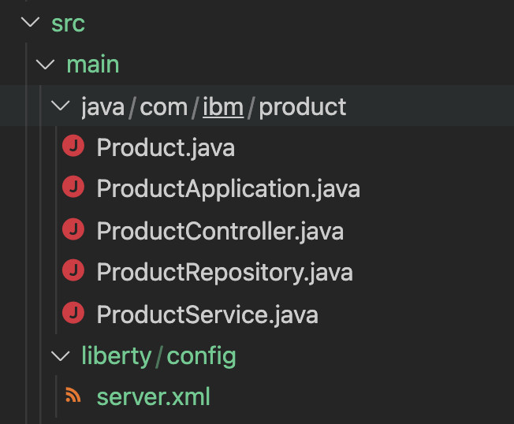

# Deploy Spring Boot Application to Redhat Openshift on IBM Cloud

In this part of the tutorial we explain how you can take a running Spring Boot Application and port it onto Redhat Openshift. We assume the usage of the Redhat Openshift on IBM Cloud (ROKS).

## Make the application run with (Open)Liberty runtime

By default the spring boot runtime embeds a Tomcat server and you could of course leave it at that. Following [article](https://developer.ibm.com/articles/6-reasons-why-open-liberty-is-an-ideal-choice-for-developing-and-deploying-microservices/) expains why especially in context of modern Kubernetes based deployment on Openshift it is interesting to use (Open)Liberty. An even further optimization could be done as explained in the [article](https://developer.ibm.com/articles/modernize-and-optimize-spring-boot-applications/)

### 1. Add the liberty plugin to the pom.xml file

The easiest way to do this is when using maven as build tool, as we do in this example, is to use the maven openliberty plugin. For this open the pom.xml file and add the below section in the plugins part.

```xml
<plugin>
    <groupId>io.openliberty.tools</groupId>
    <artifactId>liberty-maven-plugin</artifactId>
    <version>3.3.3</version>
    <configuration>
      <appsDirectory>apps</appsDirectory>
      <installAppPackages>spring-boot-project</installAppPackages>
      <include>minify,runnable</include>
      <packageName>ProductSpringBootApp</packageName>
    </configuration>
    <executions>
      <execution>
     <id>package-server</id>
     <phase>package</phase>
     <goals>
       <goal>create</goal>
       <goal>install-feature</goal>
       <goal>deploy</goal>
       <goal>package</goal>
     </goals>
      </execution>
    </executions>
</plugin>
```

This plugin allows maven to package and run an application as a spring boot application based on liberty runtime. As you can see in the code we have added the necessary goal descriptions to allow packaging applications. Mor details on the usage of this plugin can be found in the [repository](https://github.com/OpenLiberty/ci.maven)

Now perform the below on a command line on the project directory.

`./mvnw install`

This will download the plugin and its dependencies from the maven repositories. As we did not yet create a configuration file for the lieberty runtime, this command produces some errors with regards to the liberty dependency towards the Spring Boot framework.

### 2. Perform a liberty package

The first step to achieve this is to add a server.xml file to configure the liberty runtime. This can be done in a liberty/config directory under the src/main. See picture below.


Add the following content in the server.xml :

```xml

<?xml version="1.0" encoding="UTF-8"?>
<server description="customer server">
    <featureManager>
        <feature>servlet-4.0</feature>
        <feature>springBoot-2.0</feature>
    </featureManager>
    <httpEndpoint id="defaultHttpEndpoint" httpPort="9080" httpsPort="9443" />
    <springBootApplication id="product" location="thin-product-0.0.1-SNAPSHOT.jar" name="product">
        <applicationArgument>--server.server.context-path=/ucll</applicationArgument>
        <applicationArgument>--server.servlet.context-path=/ucll</applicationArgument>
    </springBootApplication>
</server>
```

Notice a few important facts in this configuration file. The Application id and name have to match with what you have been using in the pom file. The jar file gets a prefix thin-. This has to do with how the liberty tools prepare the Spring boot application for the Liberty runtime. The orignal fat jar file is stripped from its internal Tomcat runtime and the needed liberty components are added into the generated jar. This is done based on the feature specifications in the config file.
The added applicationArguments will determine the contextroot for the application and the servlets deployed.

### 3. Test the application

It is now possible to run the application with the liberty runtime. This can be done with the command :

```sh
./mvnw liberty:run
```

This is packaging the application, generating the new jar file and starting the liberty server. Notice the server will be running on the ports specified in the server.xml file.

## Ensure the application can run in a Docker container

Now we need to create a docker file so that we can create a docker image running the liberty server. Some detailed information can be found [here](https://openliberty.io/guides/spring-boot.html#building-and-running-the-application-in-a-docker-container).

### 1. Modify the application.properties

If we still want to use a database running on our local machine we need to change the application.properties file. A jdbc url with localhost will not work when the application is running in a docker container. Ensure that you use a hostname or ip address in the url which is reachable from the docker network. 

```properties
...
spring.datasource.url= jdbc:postgresql://<hostname>or<address>:5432/postgres?useSSL=false
...
```

Now perform a `./mvnw package` to pick up the change.

### 2. Create a docker file

The needed docker file can be seen below :

```Dockerfile

# Stage and thin the application
FROM openliberty/open-liberty:21.0.0.1-full-java11-openj9-ubi as staging

COPY --chown=1001:0 target/product-0.0.1-SNAPSHOT.jar \
                    /staging/fat-product-0.0.1-SNAPSHOT.jar

RUN springBootUtility thin \
 --sourceAppPath=/staging/fat-product-0.0.1-SNAPSHOT.jar \
 --targetThinAppPath=/staging/thin-product-0.0.1-SNAPSHOT.jar \
 --targetLibCachePath=/staging/lib.index.cache

# Build the image
FROM openliberty/open-liberty:21.0.0.1-kernel-slim-java11-openj9-ubi

ARG VERSION=1.0
ARG REVISION=SNAPSHOT

LABEL \
  org.opencontainers.image.authors="UCLL" \
  org.opencontainers.image.vendor="UCLL OpenLiberty" \
  org.opencontainers.image.url="local" \
  org.opencontainers.image.source="https://github.com/OpenLiberty/guide-spring-boot" \
  org.opencontainers.image.version="$VERSION" \
  org.opencontainers.image.revision="$REVISION" \
  vendor="UCLL Open Liberty" \
  name="product" \
  version="$VERSION-$REVISION" \
  summary="The product application from the Spring Boot tutorial" \
  description="This image contains the product application running with the Open Liberty runtime."

COPY --chown=1001:0 src/main/liberty/config /config/

# This script will add the requested XML snippets to enable Liberty features and grow image to be fit-for-purpose using featureUtility. 
# Only available in 'kernel-slim'. The 'full' tag already includes all features for convenience.
RUN features.sh


COPY --chown=1001:0 --from=staging /staging/lib.index.cache /lib.index.cache
COPY --chown=1001:0 --from=staging /staging/thin-product-0.0.1-SNAPSHOT.jar \
                    /config/apps/thin-product-0.0.1-SNAPSHOT.jar

RUN configure.sh
```

This is a multi stage docker file. First we use a staging part based on a full liberty image. This includes the various liberty tools like the SpringBootUtility to produce a liberty enabled jar file.
The actual image is based on a slim image where only the features needed for the application are being included. This is achieved by running the features.sh command. Then the jar file and the server configuration are copied in the correct paths.
Perform a docker build.

`docker build -t product .`

### 3. Test running in a container

Now you should be able to run the application as a docker container. This can be done with the docker command line.

`docker run -p 9080:9080 product`

Test that the application is running again on your local machine.

## Create yaml files for deployment

A number of things still need to happen before we can run the application on our ROKS Openshift cluster. We will no longer be able to rely on a local properties file to connect to the database and you need also a database which is reachable from your cluster. In our case we used the IBM Cloud Postgresql service, but you could also use another location as long as it is reachable.
Instead of a properties file we will use a config map and a secret for the base properties and user/password respectively.
From now on we presume you have a command window open where you are logged into your openshift cluster.

`oc login --token=<your token> --server=https://<your-roks-cluster>.containers.cloud.ibm.com:32271`

Remember that you can obtain this command line through the Openshift graphical console in IBM Cloud.

Start out by creating a name-space for your application. 

`kubectl create namespace ucll-product`

### 1. Create a config Map

The properties for the application which were in application.properties will now have to go into a config map. The exception being the user/password which in Kubernetes you would typically store in a secret.
The config Map depends on the connection data for your database, but could look something like :

```yaml
---
apiVersion: v1
kind: ConfigMap
metadata:
  name: product-configmap
  labels:    
    app: "product"
data:
  spring.jpa.database: "POSTGRESQL"
  spring.datasource.platform: "postgres"
  spring.datasource.url: "jdbc:postgresql://<yourdatabase-service>.databases.appdomain.cloud:31478/postgres"
  spring.datasource.ssl: "true"
  spring.datasource.sslmode: "verify-full"
  spring.jpa.show-sql: "true"
  spring.jpa.generate-ddl: "true"
  spring.jpa.hibernate.ddl-auto: "create-drop"
  spring.jpa.properties.hibernate.jdbc.lob.non_contextual_creation: "true"  

```

Keep in mind that you want to exclude this file (and for sure the secret file) from the git repository as it contains sensitive information about connection to a backend/cloud database.
Create the config map with `kubectl apply -f product-config.yaml`


### 2. Create a secret

In a similar manner we will define a secret containing userid and password.

```yaml

---
apiVersion: v1
kind: Secret
metadata:
  name: postgresql-credentials
  labels:    
    app: "customer-service"
type: Opaque
data:
  spring.datasource.username: "<base64-encoded-user>"
  spring.datasource.password: "<base64-encoded-password>"

```

### 3. Create a deploy.yaml file

## Setup a devops pipeline
